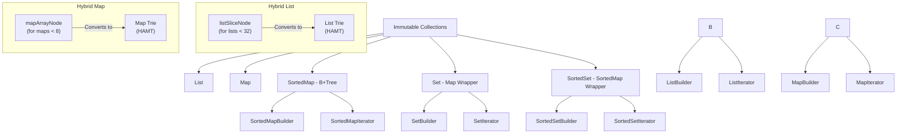
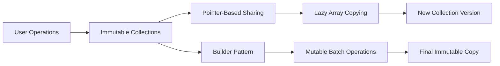
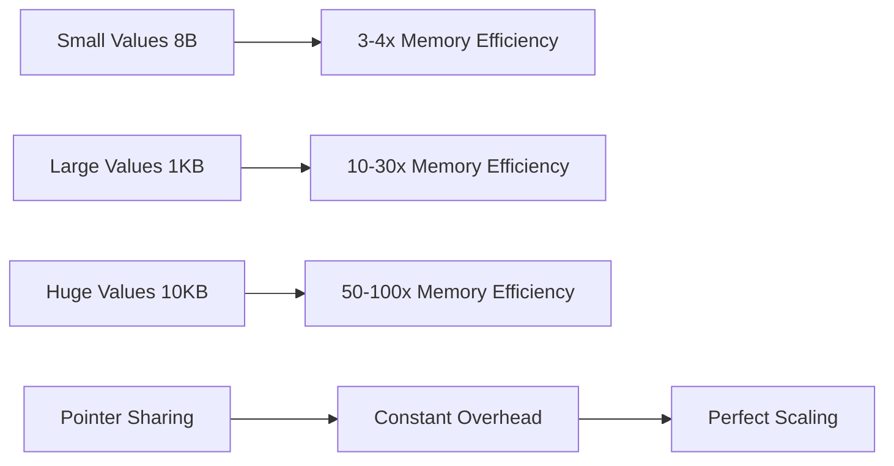

# System Patterns: Immutable Data Structures Library
*Version: 1.1*
*Created: 2024-12-19*
*Last Updated: 2024-12-19*

## Architecture Overview
The library implements immutable data structures using advanced tree-based algorithms optimized with pointer-based structural sharing for maximum memory efficiency and concurrent safety. A key architectural pattern is the use of **hybrid data structures**, which employ simple, slice-based storage for small collections and transparently convert to a more scalable persistent trie (HAMT) structure for larger collections. This provides optimal performance for the most common use cases (small collections) while ensuring scalability.

## Key Components
- **List**: Hybrid structure. Starts as a simple slice (`listSliceNode`) for high performance with small collections, and transparently converts to a bit-partitioned trie (HAMT) for `O(log n)` scalability with larger collections.
- **Map**: Hybrid structure. Starts as a simple slice of key-value pairs (`mapArrayNode`) and converts to a Hash Array Mapped Trie (HAMT) with optimized pointer-based array sharing for larger maps.
- **SortedMap**: B+tree with configurable node size
- **Set/SortedSet**: Zero-overhead wrappers using Map[T, struct{}] pattern
- **Builders**: Mutable construction patterns for efficient batch operations
- **Iterators**: Forward/backward traversal with seek capabilities

## Design Patterns in Use
- **Hybrid Data Structure:** Using a simple, fast implementation for small, common cases and automatically promoting to a more complex, scalable implementation for larger cases. This is applied to both `List` and `Map`.
- **Optimized Copy-on-Write**: Pointer-based structural sharing with lazy array copying
- **Builder Pattern**: Efficient batch construction for large collections
- **Iterator Pattern**: Uniform traversal interface across all collections
- **Flyweight Pattern**: Shared immutable nodes reduce memory overhead
- **Wrapper Pattern**: Sets implemented as zero-cost abstractions over Maps

## Optimized Data Flow
Data flows through immutable operations using pointer-based sharing for maximum efficiency.

## Key Technical Decisions
- **Pointer-Based Arrays**: mapHashArrayNode uses *[32]mapNode instead of [32]mapNode for 53% memory reduction
- **Lazy Array Copying**: Arrays copied only when actually modified, not on every clone
- **Trie-based List**: Enables efficient append/prepend with O(log n) complexity
- **HAMT for Map**: Provides excellent hash collision handling and memory efficiency
- **B+tree for SortedMap**: Ensures sorted iteration with good cache locality
- **32-bit Bitmap Indexing**: Optimizes memory usage in sparse tree nodes
- **Generic Type System**: Leverages Go 1.18+ generics for type safety
- **Zero-Cost Wrappers**: Sets implemented as thin wrappers over Maps

## Performance Architecture
The optimized architecture provides exponential scaling benefits with value size:

## Component Relationships
All collections implement common optimized patterns:
- **Immutable core operations** returning new instances with pointer sharing
- **Builder variants** for efficient batch construction using mutable operations
- **Iterator interfaces** for traversal with zero-allocation reads
- **Hasher/Comparer interfaces** for key handling
- **Wrapper relationships** allowing Sets to inherit Map optimizations automatically

## Thread Safety Guarantees
- **Lock-Free Operations**: No mutexes or synchronization primitives needed
- **Immutable Guarantees**: Original data never changes after creation
- **Atomic Copying**: All modifications complete before new versions are visible
- **Perfect Concurrency**: Read operations scale linearly with CPU cores
- **Structural Sharing**: Pointer-based sharing maintains thread safety

## Memory Optimization Patterns
- **Eliminated Clone Bottleneck**: mapHashArrayNode.clone removed from hot path (53% allocation reduction)
- **Pointer-Based Sharing**: Share array pointers instead of copying 256-byte arrays
- **Lazy Copying**: Arrays copied only when modification actually occurs
- **Zero-Overhead Abstractions**: Sets add no memory or performance overhead
- **Cache-Friendly Design**: Pointer sharing improves cache locality

---

*This document captures the optimized system architecture and design patterns used in the project.* 